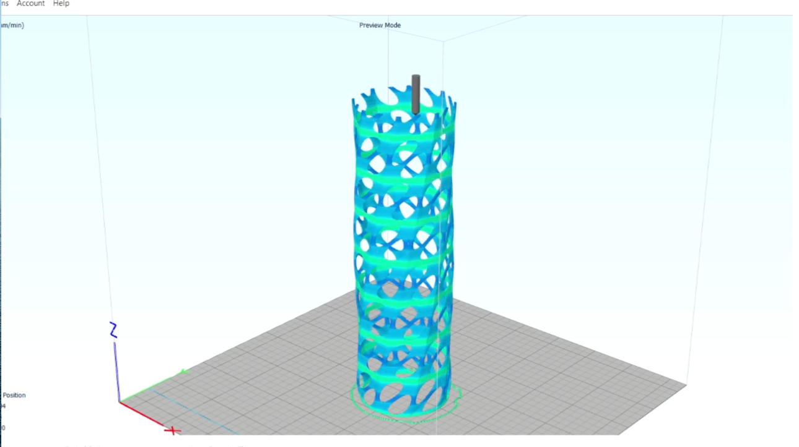

# Neopixel Lamp
This Neopixel code creates an array of vibrant color patterns, dynamically changing based on the user's proximity. The project utilizes parametric software and advanced 3D printing techniques to produce intricate and captivating patterns, resulting in an extraordinary visual experience.

